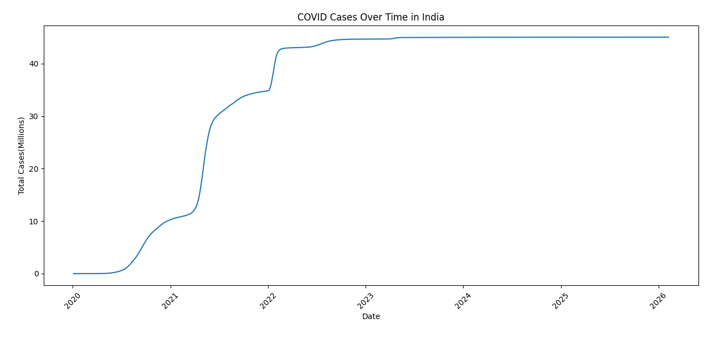
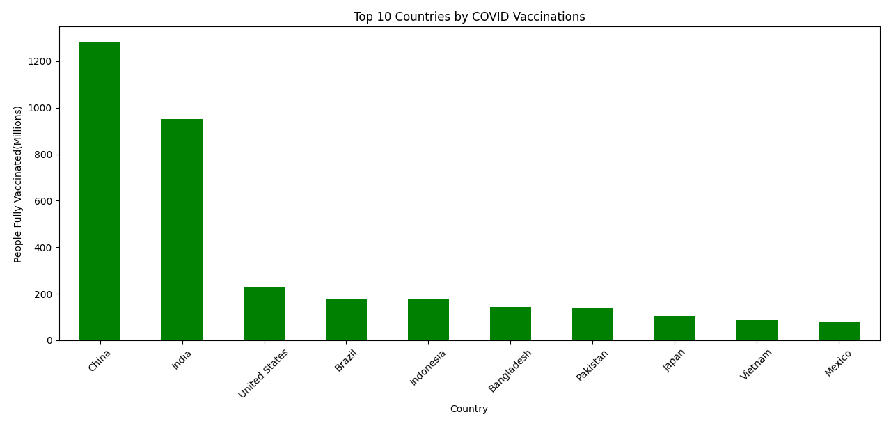

# COVID Data Analysis using Python

This project analyzes COVID-19 data using Python.

## Tools Used
- Python
- Pandas
- Matplotlib

## Dataset
COVID dataset from Our World in Data.

## Analysis Performed
1. COVID cases trend over time in India
2. Top 10 countries by vaccinations

## Visualizations

### India COVID Cases Trend

### Top Countries by Vaccinations

